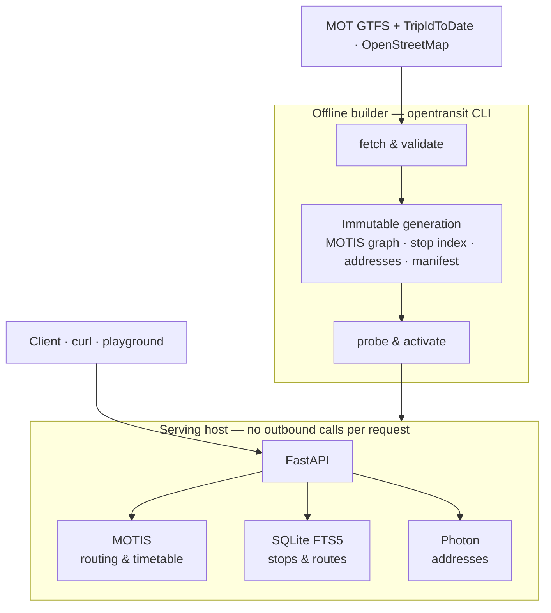

# OpenTransit Israel

**A fast, ad-free, open-source journey planner for Israeli public transport — built API-first.**

Buses, Israel Railways and light rail, with walking and transfers, planned from the
Ministry of Transport's nationwide timetable and OpenStreetMap. No ads, no tracking,
no account: just how to get from here to there.

[](LICENSE)
[](services/api/pyproject.toml)
[](services/api/)
[](https://github.com/motis-project/motis)
[](PROJECT_STATUS.md)

> **Status — October 2026:** the scheduled journey API works end to end on a local
> machine against the real nationwide feed and has passed its local acceptance runs.
> It is **not deployed** and there is no public endpoint or app yet. Times are
> **scheduled** only; live arrivals and service alerts are deliberately deferred.
> The live dashboard is [PROJECT_STATUS.md](PROJECT_STATUS.md).

---

## Why

Existing Israeli transit apps solve routing but wrap it in advertising, clutter and
data collection. OpenTransit aims to be the "BetterRail for all Israeli public
transport": fast, honest about what it knows, privacy-conscious by default and open
source. The API comes first so that the same engine can serve a mobile app, a website
or anyone else's client. See the [product requirements](PRD.md).

## What it does today

```text
OpenTransit scheduled journey demo (Dizengoff Center -> Technion)
  Generation: 5eb4e43d… (real data, freshness current)
  Coverage:   2026-10-01T00:00:00+03:00 .. 2026-11-01T00:00:00+02:00
  Realtime:   not_enabled
  Outcome:    routes_found (3 journey(s))

  Journey 1: depart 08:08 arrive 09:52 (1h44m, 2 transfer(s), walking 12m / 883 m)  [scheduled]
    08:08-08:11  walk  START -> דיזנגוף סנטר/דיזנגוף
    08:11-08:18  bus   דיזנגוף סנטר/דיזנגוף -> ת. רכבת השלום line 8 (דן)
    08:21-09:24  rail  השלום -> חוף הכרמל (רכבת ישראל)
    09:33-09:47  bus   ת. רכבת חוף הכרמל -> טכניון/מעונות העמים line 1 (אגד)
    09:47-09:52  walk  טכניון/מעונות העמים -> END
```

<sub>Abridged from the recorded [acceptance-run demo](services/api/results/acceptance-oct1b-20261001-02/acceptance-oct1b-20261001-02-demo.txt) (`opentransit demo`, 1 October 2026 feed).</sub>

| Capability | Endpoint | |
| --- | --- | --- |
| Journey planning: depart-at / arrive-by, alternatives, mode filters, walking limits | `POST /v1/journeys` | ✅ |
| Place, stop and address search in Hebrew and English | `GET /v1/places` | ✅ |
| Stops, routes and route patterns | `GET /v1/stops`, `/v1/routes`, `/v1/routes/{id}/patterns` | ✅ |
| Scheduled departures for a stop on a service date | `GET /v1/stops/{id}/departures` | ✅ |
| Dated trip details with every stop call | `GET /v1/trips/{tripRef}` | ✅ |
| Feed generation, coverage and freshness | `GET /v1/status`, `/readyz`, `/healthz` | ✅ |
| Live arrivals, delays, vehicle positions | — | ⏳ deferred |
| Service alerts | — | ⏳ deferred |

Unavailable features are reported as `not_enabled`, never as an empty "no disruptions"
result. Every response is bound to a single immutable **feed generation** so that a
search, a journey and its trip details always agree with each other.

### Measured on the real feed

| Check | Result |
| --- | --- |
| Nationwide timetable | 544,338 trips and 20.1 M stop times parsed; 10/10 integrity checks |
| Route quality (human review against Moovit) | 9 of 10 required journeys judged usable |
| Search corpus (183 queries) | 148 top-1, 165 top-5; p95 latency 42.5 ms |
| Readiness and engine verification | `/readyz` 50/50, walking-limit conformance 0 violations |
| Zero-downtime generation switch (local Compose) | 10/10 checks; 27,000+ requests during reload and switch, all succeeded |

These are local, single-machine results. They are not production capacity or
deployment evidence. Raw records live in [`services/api/results/`](services/api/results/)
and [`poc/results/`](poc/results/).

## How it works



- **Builder.** `opentransit build-generation` turns one validated feed snapshot into a
  complete, hashed and self-verifying generation in a single command (about an hour
  and 4 GB for the nationwide feed with addresses).
- **Routing.** [MOTIS](https://github.com/motis-project/motis) plans the journeys;
  the API normalises its output, preserves full trip identity and service dates, and
  enforces request bounds and walking limits.
- **Search.** A per-generation SQLite index of stops, routes and OSM localities, plus
  generation-bound [Photon](https://github.com/komoot/photon) addresses and MOTIS
  points of interest, queried concurrently.
- **Activation.** New generations are probed before they serve traffic; switching
  and rollback keep in-flight requests on the generation they started with.
- **Hosting (planned).** AWS ECS Fargate with API, MOTIS and Photon in one task and
  the generation baked into a private image, within an 8 GiB serving budget. Drafts
  live in [`deploy/aws/`](deploy/aws/README.md); nothing is deployed.

Deeper reading: [architecture overview](docs/architecture.md),
[system design](docs/system-design.md), [data contracts](docs/data-contracts.md) and
the [ADRs](poc/docs/adr/).

## Getting started

Requirements: [uv](https://docs.astral.sh/uv/) (it installs Python 3.14 for you),
Docker with a Linux engine for anything that serves routes, and Node.js only for
the playground's JavaScript tests.

**1. Look at the recorded evidence** — no Docker, downloads or credentials:

```sh
python poc/poc_status.py
```

**2. Run the test suite** — offline, using labelled synthetic engine responses:

```sh
uv run --project services/api --locked pytest services/api/tests -m "not integration" -q
uv run --project services/api --locked ruff check services/api/src services/api/tests
```

**3. Build a generation and serve it.** This downloads the nationwide feed and OSM
extract and needs roughly 5 GB of free disk:

```sh
uv run --project services/api --locked opentransit fetch --output <sources-dir>
uv run --project services/api --locked opentransit build-generation \
  --snapshot <snapshot> --output <new-generation-dir> --first-day <YYYY-MM-DD> --days 31
```

Serve it with MOTIS and the API in Docker (the runbook covers both the plain Compose
stack and the acceptance runner, which also starts Photon for address search). With
the API on port 8000, plan a journey, then open the interactive docs at
`http://127.0.0.1:8000/docs` or the map playground at `http://127.0.0.1:8000/playground/`:

```sh
uv run --project services/api --locked opentransit demo --api-url http://127.0.0.1:8000
curl --json @services/api/examples/journey.json http://127.0.0.1:8000/v1/journeys
```

Set `departAt` in the example to a time inside your generation's coverage. The
[development runbook](docs/development.md) has the exact commands, address search
options, activation and rollback, and Windows notes.

## Repository layout

```text
services/api/   FastAPI service and the `opentransit` CLI (builder, operator, demo),
                tests, acceptance tools and recorded results
poc/            Phase 0 feasibility experiments, test corpora, ADRs and evidence
deploy/aws/     ECS Fargate, ECR and IAM drafts (validated locally, not deployed)
tools/load/     k6 load-test scenarios
docs/           Requirements, design, runbooks, policies and research notes
compose.yaml    Local MOTIS + API stack for a prepared generation
PRD.md          Product requirements and phase gates
PROJECT_STATUS.md   Live progress dashboard and handoff
```

## Roadmap

| Phase | Goal | State |
| --- | --- | --- |
| 0 | Prove the data and routing are good enough | Static data and routing proven; release terms pending |
| 1 | Scheduled journey API | Built and accepted locally; operations, load testing and deployment next |
| 2 | First mobile/web client | [Design proposal](docs/client-design.md) |
| 3 | Live arrivals and service alerts, then realtime-aware routing | Waiting on data access |
| 4 | Reliability insights from historical delays | Offline groundwork from the [Open Bus archive](docs/research/open-bus.md) |
| 5 | Public open-source product | Future |

Release still requires settled terms for the datasets used; that request to the
Ministry of Transport is in progress ([access record](docs/data-usage-and-access.md)).

## Data and attribution

- Public transport schedules: **Israel Ministry of Transport and Road Safety** (GTFS
  and TripIdToDate). Usage terms are still being confirmed; this credit implies no
  endorsement.
- Maps, walking network and addresses: **© OpenStreetMap contributors**, under the
  [ODbL](https://opendatacommons.org/licenses/odbl/1-0/), via Geofabrik extracts.
- Historical research data: the public archive of [Hasadna's Open Bus](https://github.com/hasadna)
  project (offline analysis only).

Details: [attribution](docs/policies/attribution.md) and [licence audit](docs/licence-audit.md).

## Contributing

The project is developed in the open and contributions are welcome. Start with
[PROJECT_STATUS.md](PROJECT_STATUS.md) for what is in progress and what comes next,
and the [continuation plan](docs/next-steps.md) for acceptance criteria. Work happens
on feature branches with pull requests into `main`. Automated agents working in this
repository follow [AGENTS.md](AGENTS.md).

## Licence

Original OpenTransit code and documentation are released under the [MIT licence](LICENSE).
Third-party components keep their own licences, and upstream datasets and anything
derived from them (graphs, indexes, databases) are **not** relicensed by MIT. Public
source availability does not mean the passenger API is deployed or that dataset
redistribution has been cleared.
