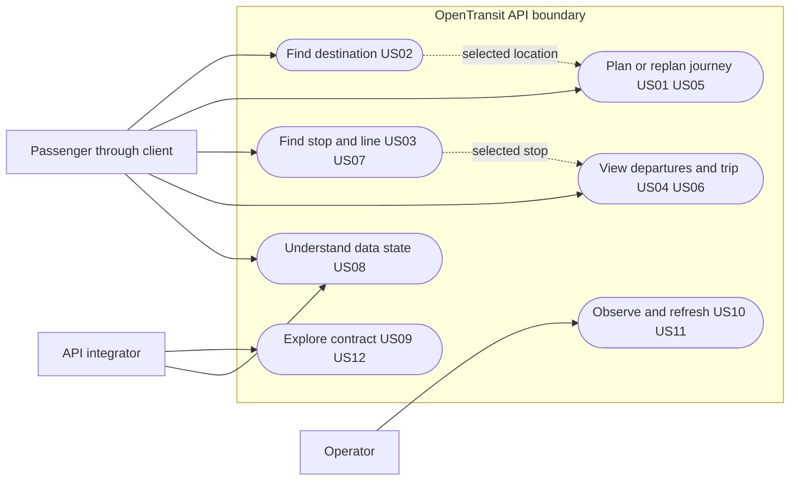

# OpenTransit API — Product Requirements

**Version:** 1.1 · **Date:** 30 September 2026 · **Implementation:** M1 authorized; dashboard records validation.

This document specifies the API product, its users, scope, stories and acceptance criteria. [System design](system-design.md) describes the implementation; [the dashboard](../PROJECT_STATUS.md) tracks progress. The [root PRD](../PRD.md) governs the overall product. Its September 25 schedule-first revision and accepted ADRs are binding. September 30 authorization accepts the planning package with R1–R5 and POST journey planning ([ADR 0007](../poc/docs/adr/0007-schedule-api-design.md)). Defaults remain values to verify; acceptance criteria are requirements, not evidence that they have passed.

**Planning gate satisfied September 30:** the user authorized applying the suggested changes and starting implementation. Static release checks and API-before-client sequencing remain unchanged.

## 1. Product outcome

Provide one documented, self-hostable API that lets a client answer: **How can I get there using scheduled Israeli public transport?** A client should be able to search, compare journeys, display a complete itinerary and inspect a stop's scheduled departures without calling transportation providers itself.

V1 covers walking, buses, rail and light rail where the accepted feeds and engine support them. It uses scheduled information only. It does not know whether a bus is currently approaching, delayed or cancelled. Every response must make that limitation machine-readable.

The API is useful on its own through HTTP tools. The first mobile/web client follows the completed schedule-based API. The API does not require user accounts or continuous location tracking.

### Success and evidence

- A deployed search → Dizengoff Center → Technion workflow returns usable scheduled alternatives with walking, transfers, stop identities and geometry.
- At least 9/10 required representative routing cases pass dated human review; automated structural checks alone do not satisfy this.
- Search supports Hebrew and English and passes the category-based acceptance below; address weaknesses cannot be concealed by strong station scores.
- Scheduled journeys meet p95 <350 ms at the API process and <400 ms from a documented deployed probe. Engine-only measurements do not establish either.
- The API truthfully distinguishes no service, no route, unavailable data and stale data.

Existing evidence: static ingestion passes technically; route quality and search review remain pending. No production API, full-stack performance result or public service availability measurement exists. See [recorded results](../poc/README.md); do not treat the historical full-scope ten-capability score as the schedule-first entry gate.

## 2. Users and ownership

| Actor | Need | API responsibility |
| --- | --- | --- |
| Everyday passenger, through a future client | Find a destination and a usable journey | Clear places, alternatives, stops, times and limitations |
| Passenger at a stop | Know the next scheduled services | Chronological departures, destination/headsign and service date |
| Client developer / open-source integrator | Build without learning GTFS or MOTIS internals | Stable JSON contract, examples, errors, versioning and source attribution |
| Future contributor (Phase 5) | Run and contribute without project-specific knowledge | Later onboarding, portable fixture bundle and contribution guidance |
| Operator / maintainer | Keep schedules current and recover safely | Validation, feed health, controlled activation, rollback and operational telemetry |

Clients own map rendering, device location permission, local favorites, recent searches and navigation UI. The API owns timetable interpretation, routing, search normalization, time/identity semantics and data health. MOTIS owns the routing computation; OpenTransit owns its public contract and quality validation.

## 3. Release scope and expansion

These API releases are subdivisions of the existing project phases, not replacements for their numbering.

| API release | Features | Project milestone mapping | Exit |
| --- | --- | --- | --- |
| A — first working local API | A coordinate-to-coordinate scheduled journey through FastAPI and the fresh prepared MOTIS graph; minimal config, errors and debug docs | M1, including a narrow first slice of M3 | One real HTTP request returns a scheduled itinerary with legs and times; missing data fails honestly |
| B — scheduled routing preview | Versioned feed, stops, nearby stops, routes/patterns, scheduled trips/departures, coordinate/stop journey planning | M2–M3 | Usable local HTTP workflow; quality work continues |
| C — schedule-based v1 | Hebrew/English place search, supported addresses/POIs, operational hardening, deployment and documentation | M4, M7, M8 | All static release criteria satisfied, then Phase 2 client |
| D — live information | Predicted arrivals, delays, vehicles and alerts; sources can be enabled independently | Deferred M5/M6 | Source-specific access, terms, matching/freshness and real-feed proof |
| E — better decisions | Realtime-aware ranking, transfer risk, optional live journey refresh | Project Phase 3 | Demonstrated improvement over scheduled ranking without misleading guarantees |
| F — reliability intelligence | Historical performance and confidence estimates | Project Phase 4 | Sufficient attributable observations and validated quality/privacy policy |

**Accepted priority correction — September 25:** make the system work before repository polish. Release A must demonstrate useful routing, not only a health endpoint. Use an existing prepared graph with verified coverage; a new nationwide ingestion pipeline is not an entry requirement for A. M2 then adds managed feeds/reference data and M3 completes routing, departures and trip details.

Contributor onboarding, portable demo bundles, contribution/issue templates, generated SDKs and community/repository polish belong to project Phase 5. CI and contract compatibility automation can follow working functionality in M7; neither blocks the first local journey. Minimal dependency pins, a short local run command, safe errors and focused behavior checks remain part of development. Planning-before-code, static release acceptance and API-before-client gates are unchanged. No dates, hosting purchases or capacity guarantees are implied.

### Explicitly outside schedule-based v1

Live positions, predictions, cancellations inferred from missing observations, alerts subscriptions, push notifications, accounts, cloud favorites, payments/fares, ticketing, ads, social features, historical analytics, isochrones, bulk transit-data export and a public administration API. Map tiles and client map hosting are separate client concerns. Accessibility guarantees and wheelchair-specific routing wait for validated source coverage; unknown accessibility must never be presented as accessible.

## 4. Functional requirements

MUST means required for the stated release. SHOULD means preferred, with any deviation recorded during review. All numeric defaults introduced here are proposed.

### F01 — place search (release C)

- Search stops/stations, POIs and supported street addresses in Hebrew and English; preserve original names and return the actual language used when a translation is unavailable.
- Accept `q`, `lang`, optional `near` and optional types. Provide ranked, deduplicated candidates with kind, display name, locality, coordinates and a usable location reference.
- A location bias is optional and affects ranking, not a hidden geographic exclusion. Ambiguous names return alternatives; the API does not silently choose a branch.
- Search operates from local prepared data. No per-request external geocoding. A category whose dependency is down is reported as unavailable; an empty successful result means the search actually ran.
- Proposed input bounds: 2–200 characters after trimming; 1–20 results, default 10. Handle Unicode and Hebrew punctuation; no guarantee of arbitrary transliteration or spelling correction before corpus validation.
- Search candidates must not suggest unsupported address precision. A street-level result is labelled street-level, not a building entrance.

### F02 — stop discovery and reference data (release B)

- Find stops in a bounding box or near coordinates and radius; require exactly one spatial selector. Return distance when a reference point is supplied.
- Return stop identity, public stop code where present, names, coordinates, parent station/platform relationships and routes serving the stop. Stop code is display data, not a guaranteed unique primary key.
- Support paginated route lookup by stop, operator or public line label. The same displayed line number can belong to multiple routes/operators.
- Route detail distinguishes branches/patterns and headsigns. Never assume a single stop order per line or equate `direction_id` with a human destination.
- Proposed nearby bounds: default radius 500 m, maximum 5 km, maximum 100 items per page. Bounding boxes have a configurable maximum area of 100 km²; nationwide downloads are not served by this endpoint.

### F03 — journey planning (basic slice in A; complete in B)

Release A needs only coordinate inputs, an explicit depart-at time, one scheduled itinerary and clear no-route/dependency errors. The full requirements below are completed in B; search, arrive-by, stop/place references and richer preferences do not block the first local result.

- Accept origin/destination as coordinates or returned stop/place references; reject raw text. Search is a separate step.
- Support depart-at and arrive-by planning, exactly one of which must be specified. A client selecting “now” sends an explicit timestamp.
- Return up to three alternatives by default, with a maximum of five; fewer results are legitimate. Deduplicate equivalent transit sequences and clearly identify walk-only alternatives.
- Return departure/arrival, elapsed duration, walking duration/distance, transfers and ordered walk/transit legs. Transit legs include operator, route, mode, headsign, boarding/alighting stops, full trip reference and service date. Supply usable geometry for each leg or an explicit geometry-unavailable reason.
- Proposed constraints: selectable bus/rail/light-rail modes; walking remains necessary access/transfer movement. `maxWalkMinutesPerLeg` defaults to 15, allowed 1–30. Return total walking separately; the setting is not a total-walk cap. Preserve the existing 15/30-minute comparisons for H3 review.
- Never quietly relax a constraint. Unsupported modes/preferences produce a typed validation error. Only advertise arrive-by and limits once the pinned engine adapter proves their semantics.
- Preserve the engine's feasible ordering initially, with a documented deterministic tie-break. Do not claim realtime-optimal, cheapest or objectively “best.” Record ranking policy/version in metadata.
- An exhausted valid search returns `200` with no journeys and `outcome: no_route`. Dependency failure, expired coverage and invalid input are distinct errors. Do not invent an exact no-route cause from an empty engine result.
- V1 journeys are self-contained responses. The client may retain a plan locally and submit a new request to replan; no server-side saved journey or refresh-token endpoint is required.

### F04 — scheduled departures and trip detail (release B)

- For a stop and explicit start timestamp, list departures in chronological order within a bounded horizon. Default horizon 120 minutes, maximum 24 hours; page size default 20, maximum 100.
- Include scheduled departure, route/headsign, platform if known, boarding restrictions and trip occurrence reference. Do not show pickup-prohibited calls as boardable departures.
- Account for services beginning on the preceding service date and continuing after midnight. Empty departures are a valid success only when coverage and query execution are valid.
- Trip detail exposes ordered calls, scheduled arrival/departure, pickup/drop-off restrictions and shape when available. Use a dated occurrence, not just a stripped GTFS trip ID.
- Stable cursor pagination must not duplicate or skip simultaneous departures. A cursor is bound to generation, query and an exact sort position.

### F05 — truthful schedule and capability states (all releases)

- Every data response includes generation, generation time, coverage, fixture/production mode and source attribution references.
- For schedule-based v1, predicted times and delays are null; `timingState` is `scheduled`. Null delay is not zero delay. No live vehicle is synthesized.
- Capability state explicitly says `not_enabled` for realtime and live alerts. An alert list is null when unavailable; `[]` is reserved for an enabled, successfully fetched source with no applicable alerts.
- Source-provided accessibility is a tri-state value: yes/no/unknown. Unknown platform or geometry stays unknown. No interpolated vehicle location is presented as observed.
- Public status distinguishes static data readiness, coverage, refresh age and individual capabilities. It omits credentials, internal hosts, raw errors and precise request locations.

### F06 — data refresh, provenance and recovery (release C)

- Ingest the accepted 60-day GTFS plus TripIdToDate pair, with hashes, source acquisition times, parser/build configuration, OSM identity and engine image digest.
- Validate integrity, referential relationships, coordinates, service coverage and pairing before activation. Retain raw inputs and previous evidence; do not overwrite the PoC.
- Publish graph, indexes and identity mappings as one generation. Requests must never mix generations during refresh.
- A failed candidate must leave the current valid generation serving. Support operator-controlled rollback and crash-safe restart into a fully validated generation.
- Old data may be served only within declared valid coverage and freshness policy, with warnings. An expired feed is not an empty timetable.

### F07 — local development, operations and later contributors

- **Release A:** keep enough configuration, safe diagnostics, a local run command and FastAPI's generated docs to call and debug the actual journey endpoint. Pin the dependencies/image used. Add focused checks for a valid route, invalid input, no-route and unavailable engine; a separate fixture platform or CI project is not a prerequisite.
- **Releases B/C:** expand schemas/examples with working features; add full readiness/status, deterministic regression fixtures, contract compatibility automation and CI during hardening. Private operational metrics and deployment instructions arrive when the service needs them.
- **Phase 5:** polished fresh-checkout onboarding, portable contributor demos, contribution guides, issue/PR templates and community tooling. These are not gates for the first working API or schedule-based v1.
- Version under `/v1`; clearly mark the local preview contract as provisional until v1 release. Do not publish planned endpoints as implemented. Protect private operator controls and keep secrets/personal travel data out of source and logs from the start.

## 5. Proposed HTTP surface

D3 POST journey planning was accepted September 30. POST reduces coordinates in URLs; it does not make request-body logging safe. Reference routes use namespaced full source IDs once M2 verifies stability. Exact schemas will be captured in OpenAPI during M1 and extended with each implemented milestone.

| Method and path | Principal input | Result | Release / story |
| --- | --- | --- | --- |
| `GET /healthz` | None | Process alive | A / US10 |
| `GET /readyz` | None | Readiness and mode; 503 if unusable | B/C / US10 |
| `GET /openapi.json`, `GET /docs` | None | Implemented API reference | A / US09 |
| `GET /v1/status` | None | Capabilities, coverage, safe health | B/C / US08 |
| `GET /v1/stops` | `near` + radius OR `bbox`, limit/cursor | Stop page | B / US03 |
| `GET /v1/stops/{stopId}` | Namespaced stop reference | Stop detail and serving routes | B / US03 |
| `GET /v1/routes` | At least one of stop/operator/line filter; cursor | Matching route page | B / US07 |
| `GET /v1/routes/{routeId}` | Namespaced route reference | Metadata and pattern summaries | B / US07 |
| `GET /v1/routes/{routeId}/patterns` | Limit/cursor | Patterns with ordered stops | B / US07 |
| `GET /v1/stops/{stopId}/departures` | `from`, horizon, limit/cursor | Scheduled departure page | B / US04 |
| `GET /v1/trips/{tripRef}` | Full source trip identity plus service date | Calls and geometry | B / US06 |
| `POST /v1/journeys` | Typed locations, time and constraints | Journey alternatives | A basic; B complete / US01, US05 |
| `GET /v1/places` | `q`, `lang`, optional `near`, types, limit | Place candidates | C / US02 |
| `GET /metrics` (conditional) | Private operator access | Bounded metrics, only if a collector needs them | C / US10 |

No `/vehicles` or `/alerts` handler is required in v1. Capability status documents the deferral; future endpoints are added only when the source is usable. Route/pattern lists use default page size 20, maximum 100.

## 6. User stories and acceptance scenarios

Each story is a release requirement, not a claim that it has passed.

| ID / user story | Given → when → then | Failure or boundary acceptance | Features / milestone |
| --- | --- | --- | --- |
| US01 Passenger: plan between two locations | Valid locations/time → plan → up to requested distinct feasible itineraries, with ordered legs and scheduled labels | An out-of-window date returns coverage error; engine failure never becomes no-route | F03/F05, M3 |
| US02 Passenger: find a Hebrew/English destination | Ambiguous destination → search → ranked candidates with locality and actual label language | Unsupported/unavailable address search is explicit; no silent station substitution | F01, M4 |
| US03 Passenger: identify nearby boarding stops | Coordinates and radius → list → distance-sorted stops and platform/parent details | Invalid coordinates/oversized region rejected; outside coverage distinguished from no nearby stops | F02, M2 |
| US04 Passenger: check departures | Valid stop and time → board → chronological boardable calls | Includes yesterday's service after midnight; no-service differs from unavailable data | F04/F05, M3 |
| US05 Passenger: arrive before an appointment | Arrive-by time and constraints → plan → all candidates meet deadline/limits | Both time modes or unsupported preference rejected; no automatic relaxation | F03, M3 |
| US06 Passenger: inspect a selected trip | Current trip occurrence → detail → ordered calls and selected service date | An absent dated occurrence returns 404; never substitute today's similarly named trip | F04, M3 |
| US07 Passenger: distinguish similarly numbered lines | Line label/stop → routes → operator, mode and branch choices | Loop and repeated-stop patterns retain distinct sequence positions | F02, M2/M3 |
| US08 Passenger/client: understand limitations | Realtime disabled or feed stale → response/status → truthful flags and null predictions | Never interpret disabled alerts as zero disruptions or scheduled times as live | F05, M1–M4 |
| US09 Integrator: build against a stable API | Running API → docs/examples → requests validate against served contract | Malformed input yields documented safe error; new unimplemented endpoints absent | F07, generated docs M1; stable contract M7/M8 |
| US10 Maintainer: observe service health | Running process with missing graph → probes → liveness 200, readiness 503 | Dependency outages update capability status without leaking private diagnostics | F05/F07, M1/M7 |
| US11 Maintainer: refresh without corrupting trips | Valid active generation → activate candidate under traffic → each request uses one complete generation | Broken/cancelled build preserves old generation; rollback never mixes index and graph | F06, M2/M7 |
| US12 Future contributor: reproduce a bug privately | Portable fixture bundle and guide → fresh checkout → deterministic replay | No MOT key or private developer setup required; no personal travel history in fixtures | F07, Phase 5; internal regression tests still grow with features |
| US13 Passenger: receive live updates later | Enabled fresh matched source → departures/journey → explicit expected time and source age | Unmatched/stale observations remain scheduled; original scheduled times remain visible | Future M5 |
| US14 Passenger: see relevant disruptions later | Fresh enabled alerts → journey → correctly scoped active alerts | Feed failure reports unavailable; unrelated direction/trip alerts do not attach blindly | Future M6 |

### Passenger use-case view

This Mermaid flowchart shows actors and use cases; UML sequence/class/state diagrams are in the system design.

## 7. Cross-cutting contract requirements

### Time, identity and geography

- Use ISO 8601 timestamps with an explicit offset for request/response instants; reject naive timestamps. Also expose the GTFS service date and `Asia/Jerusalem` timezone where relevant.
- A service date is not necessarily the local calendar date of a stop call. GTFS values over 24 hours and daylight-saving boundaries need dedicated validation.
- Public references are opaque and generation-scoped. A trip occurrence combines full source trip ID, service date and generation; repeated stop calls add stop sequence. Never identify trips using normalized/stripped IDs alone.
- R2: stop/route references retain namespaced source IDs if daily-feed stability is proven; absent references return 404. Dated trips preserve full identity. Unsigned cursors bind generation/query/sort position; a mismatch returns `422 INVALID_CURSOR` and requires a fresh listing. Long-lived favorites retain coordinates/display metadata as hints.
- Coordinates use WGS84 with named latitude/longitude fields; geometry uses GeoJSON longitude/latitude order. National feed coverage does not guarantee routability at every coordinate.

### Response and error semantics

Common data envelope: `data`, `meta` (request ID, generatedAt, generationId, mode, coverage, freshness, capabilities, attribution), `warnings`, and optional `page`. No internal stack traces, URLs containing keys or raw user input in errors.

| HTTP | Stable application code / meaning |
| --- | --- |
| 200 | Successful result, including valid empty search/departures or `outcome: no_route` |
| 400 | Invalid/modified cursor or malformed request syntax |
| 404 | Unknown active-generation resource |
| 413 | Request exceeds size limit |
| 422 | Invalid field, out of service area, outside service window, unsupported constraint |
| 429 | Caller rate limit exceeded, with Retry-After |
| 503 | Required data/engine unavailable, feed expired, or server overloaded |
| 504 | Routing dependency exceeded the request deadline |

Use `application/problem+json` with standard problem fields plus `code`, `requestId` and sanitized field errors. [RFC 9457](https://www.rfc-editor.org/rfc/rfc9457.html) defines this error representation. Error fields contain field names/reasons, not rejected coordinates or free-text query values.

### Privacy, compatibility and fair use

No accounts, durable journey history or exact-location analytics. Query strings, request bodies and sensitive path identifiers are removed from proxy/application telemetry. No public edge caching of journeys or location-bearing searches. TLS for public transport; explicit CORS origins for browser clients. CORS is not authentication or protection against scripts.

Read endpoints are anonymous initially. Apply bounded request size, spatial area, result count, time horizon and per-client rate limiting. Operator interfaces, metrics and artifacts are private. Exact rate limits and retention defaults are proposed in the design and must be measured before public launch.

## 8. Nonfunctional requirements and acceptance

| ID | Requirement / proposed release criterion | Measurement |
| --- | --- | --- |
| N01 | Journeys p95 <350 ms API, <400 ms deployed probe | Real mix of valid routes/no-route cases; record server and external timing separately |
| N02 | Place search and departures p95 <40 ms API | Accepted data; category and cold/warm breakdown; no external calls |
| N03 | Whole serving stack plus overlapping replacement fits intended 8 GiB aggregate serving cap; this is a ceiling, not minimum task RAM | Peak memory under representative traffic and activation, including old/new Fargate tasks and edge components; separately record platform/build memory |
| N04 | No user-request dependency calls leave the serving host/task | Dependency instrumentation/network policy; production MOTIS calls stay on localhost in the same Fargate task |
| N05 | No mixed-generation response or false-live claim | Concurrent activation and degraded-state scenarios |
| N06 | Proposed public beta availability target 99.5% monthly; planned maintenance counts | External probes; one steady serving task is not HA; replacement recovery must be tested |
| N07 | Bounded failure and overload | Timeouts/cancellation and request caps verified; no unbounded queues |
| N08 | Freshness and valid service coverage visible | Failed refresh and expired coverage scenarios; proposed freshness policy in design |
| N09 | Reproducible clean startup and compatible API | Pinned dependencies/images, fixture smoke test, schema compatibility checks |
| N10 | No precise passenger data or credentials in standard logs | Sentinel request/error log inspection including reverse proxy |

These are targets, not measured claims. If a target cannot be achieved, record the evidence and review the scope/architecture before changing it. Do not raise the serving cap merely to make the result pass.

### Static release gate

1. F01–F06, the release A–C portions of F07 and US01–US11 pass at their assigned milestones; US12 contributor packaging is deferred to Phase 5; API-only demo works against current real data.
2. H3: at least 9/10 required representative routes usable, including transfers, overnight/service-day boundaries, Shabbat/no-service and genuine no-route cases, with dated comparisons.
3. H4: rerun the accepted-feed corpus and obtain explicit human verdicts. Proposed stronger v1 thresholds: top-5 acceptable destination >=90% overall, >=90% stops/stations and >=80% in each supported address/POI category; Hebrew and English each >=85%. Report sample sizes and failures. Expand underrepresented language/category cells before claiming coverage. These thresholds need review and do not retroactively pass the historical 89/100 result.
4. Address support remains a v1 requirement. If H4 cannot meet it, fix it or explicitly approve a constrained stop/POI-only release; do not silently drop addresses.
5. Current feed validity, static dataset/OSM terms and attribution have recorded evidence. Technical downloads do not establish accepted usage terms.
6. N01–N10 validated; activation/rollback demonstrated; operational runbook and API documentation ready. No realtime credentials required.

Development-time tests are introduced with behavior. There is no new requirement to run this whole suite before M1. The planning hold was satisfied by the September 30 implementation authorization.

## 9. Later feature acceptance and compatibility

| Expansion | Product behavior | Entry evidence | Contract impact |
| --- | --- | --- | --- |
| Live arrivals/delays | Expected times alongside schedule, observation age and coverage | Sustainable source/terms, date-aware matches over thousands of observations, per-operator/mode error and ambiguity counts, explicit acceptance thresholds | Populate reserved nullable timing fields; enable capability; scheduled values unchanged |
| Vehicles | Only observed positions, with timestamp and matching confidence | Position quality/coverage and retention policy validated | New bounded `/v1/vehicles` endpoint; no interpolation labelled live |
| Alerts | Active source messages scoped to route/stop/trip/time | Real feed access, entity resolution and unavailable-vs-empty cases | New endpoint and journey enrichment; null vs empty semantics preserved |
| Live journey refresh | Re-evaluate a selected plan without hiding changed connections | Stable occurrence identity and refresh lifetime policy | Prefer explicit refresh API; no silent change to saved scheduled results |
| Realtime-aware routing | Avoid missed transfers and compare live alternatives | Evaluation corpus showing benefit and clear behavior on stale input | New opt-in ranking policy before changing default behavior |
| Reliability intelligence | Historical delay/transfer confidence with sample size | Sufficient attributed history, quality thresholds and retention terms | New versioned metrics; estimates distinct from predictions |
| Accessibility and personalization | Validated step-free preferences; optional account sync | Reliable accessibility data; separate privacy/identity requirements for accounts | Explicit feature proposal; never inferred from unknown data |

A realtime application still pending at the October 19 checkpoint does not block the static product. No source is accepted for production merely because it was useful in an experiment.

## 10. Decisions for review

| Topic | Draft recommendation | When it matters |
| --- | --- | --- |
| Journey HTTP method (D3) | Accepted September 30: POST JSON; reference reads GET | M1 |
| Search implementation (D4) | Local stop index plus MOTIS first; choose address fix from category evidence | M4; address requirement unchanged |
| Search thresholds and walking default | Proposed above; preserve H3/H4 human review | Before scoring release acceptance |
| Scope detail | Include route/pattern reference reads and arrive-by in scheduled v1 | Before M2/M3 implementation |
| Availability, limits and freshness | Start with design defaults; tune with recorded evidence | M7/M8 |
| Hosting (D5) | ACCEPTED September 30: ECS Fargate, private ECR generation image, S3 optional; [hosting plan](next-steps.md#hosting-plan) | M1 local; region/task size/ingress/cost validated at H-0, preview H-1, operations M7/M8; not deployed |

The current draft is complete enough for product review. Acceptance of this document is separate from implementation, test passage and live-source approval.
