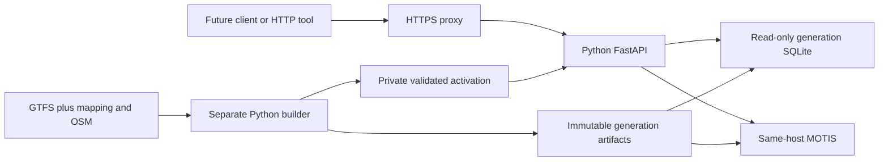

# OpenTransit — Architecture overview

**30 September 2026 · Accepted design direction (ADR 0007).** Schedule-based v1; Python/FastAPI and MOTIS accepted. M1 is authorized; see the dashboard for implemented and tested behavior. This overview replaces the earlier realtime-first proposal. It is a component map, not a second system design or status log.

## Read in this order

1. [Product PRD](../PRD.md): overall product and accepted phase changes.
2. [API PRD](api-prd.md): API releases, requirements, user stories and acceptance.
3. [System design](system-design.md): module structure, UML class/sequence/state diagrams, contracts and operations.
4. [Continuation plan](next-steps.md): milestone implementation criteria.
5. [Dashboard](../PROJECT_STATUS.md): progress and session handoff.

## Current design boundary

| Component | Responsibility | Boundary |
| --- | --- | --- |
| API | Validate, orchestrate and normalize search/routes/departures/reference data | No external per-request calls, user history or feed building |
| MOTIS | Routing, scheduled trip/stop-time access and initial geocoding | Private on-host dependency; normalized behind an adapter |
| Immutable indexes | Stops/routes/pattern identities and local search | Read from one pinned generation per request |
| Builder | Download, validate, normalize and build candidate artifacts | No writes into active generation; preserve source provenance |
| Generation reference | Capture one immutable object per request; local pointer/reload or complete ECS task replacement | No mixing new SQLite and old graph; each Fargate task pins one generation |
| Artifact store | Retained raw sources/evidence plus reproducible graph/index/manifest generations | Private ECR generation images for production; retained operator sources initially; S3 optional |
| PoC Postgres/PostGIS | Existing ingestion/staging evidence | Not a required passenger request dependency; accepted PoC decision preserved |

## Core invariants

- V1 answers from schedules and labels them scheduled. Predictions and delays are null; live alerts are not enabled, not “no disruptions.”
- Full trip identity includes feed generation and service date; calls add sequence. Source display codes do not replace primary identity.
- Requests retain one generation through all awaits. Activation switches the graph endpoint and indexes together; old resources drain safely.
- No passenger request leaves the serving host. Feed/source access happens in background builder or later live ingester processes.
- Missing, expired, stale, no-route and valid-empty states remain distinguishable.
- Whole-stack serving and replacement are measured under the intended 8 GiB cap; build memory is separate. No daily-user/cost guarantee follows from engine evidence.
- Private control/metrics, safe logs, bounded requests and local favorites keep personal travel data out of persistent server state.

## Selected hosting — 30 September 2026

Use **AWS ECS on Fargate**, with FastAPI and MOTIS in the same task and the prepared graph, manifest and later SQLite packaged in a **private ECR image**. Pin image digests; verify the local generation before readiness. Feed refresh deploys a new complete task revision and drains old requests. During rollout requests may use either complete generation. Local Docker Compose remains for M1/M2; its pointer/reload controls are not production ECS controls.

S3 is optional; retained raw sources, hashes and reviewed evidence must survive outside disposable task storage. Test 0.5 vCPU / 2 GiB before choosing resources; the 8 GiB aggregate serving ceiling includes task replacement overlap and is not a minimum allocation. No production deployment or capacity claim exists. Region, HTTPS ingress, automated refresh retention and total cost remain to validate. Future SIRI needs fixed outbound access only for its collector (NAT Gateway + Elastic IP, subject to MOT approval); realtime stays deferred. See [ADR 0007 amendment](../poc/docs/adr/0007-schedule-api-design.md#hosting-amendment--accepted-30-september-2026) and [hosting plan](next-steps.md#hosting-plan).

The component diagram above describes the logical request/build boundary. In production, private ECR supplies generation files at task startup and ECS controls revision rollout; passenger requests stay inside their API/MOTIS task.

## Later expansion

Add a single-owner realtime ingester, dated matching and compatible immutable snapshots when access/terms and live evidence permit. Add alerts independently, then realtime-aware ranking and historical reliability. Do not install Redis, analytics storage or source pollers preemptively. The [future design](system-design.md#13-future-live-integration) specifies the extension boundaries.

The user authorized the planning changes and implementation September 30. This does not change the API-before-client gate or mark any quality/access review complete.
