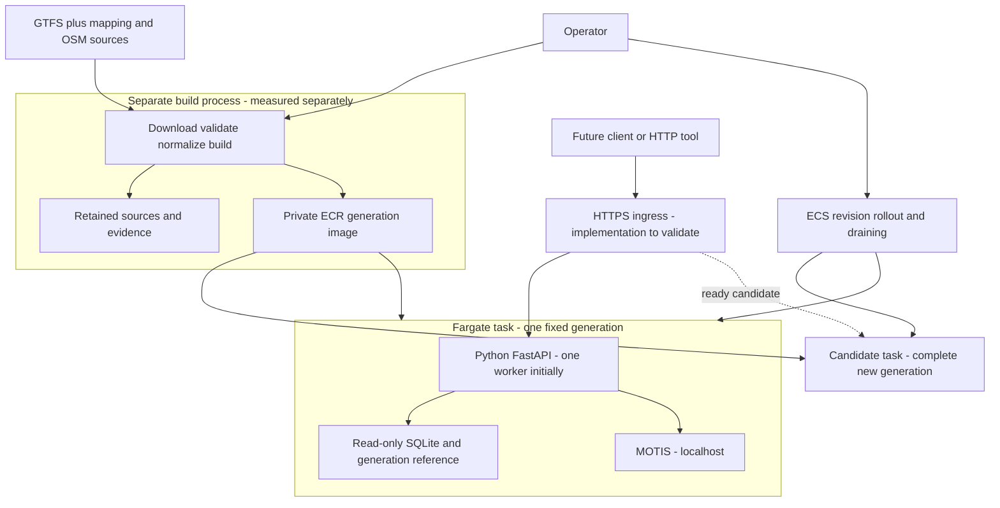
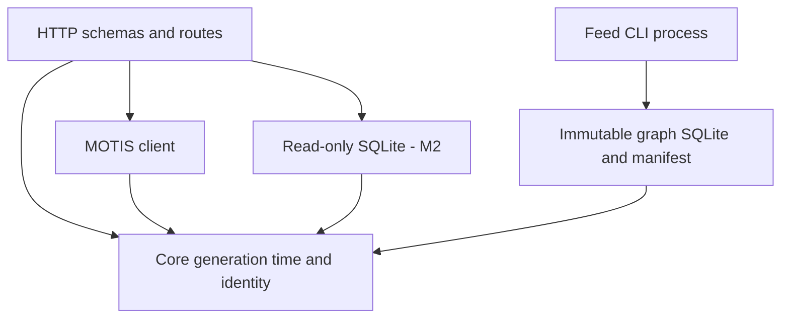
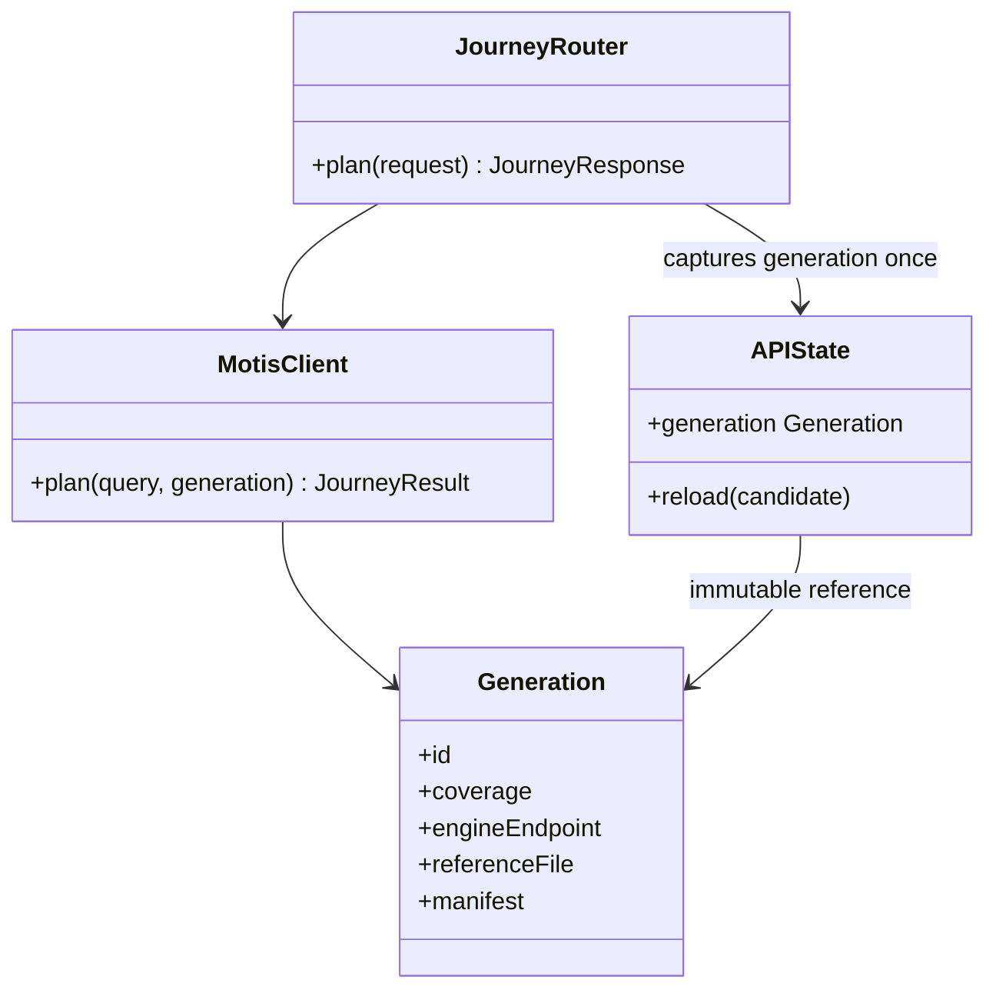
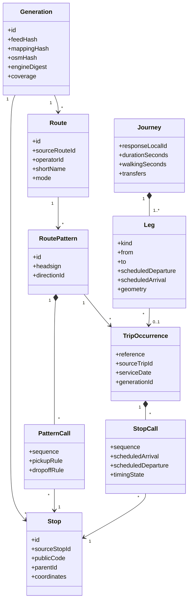
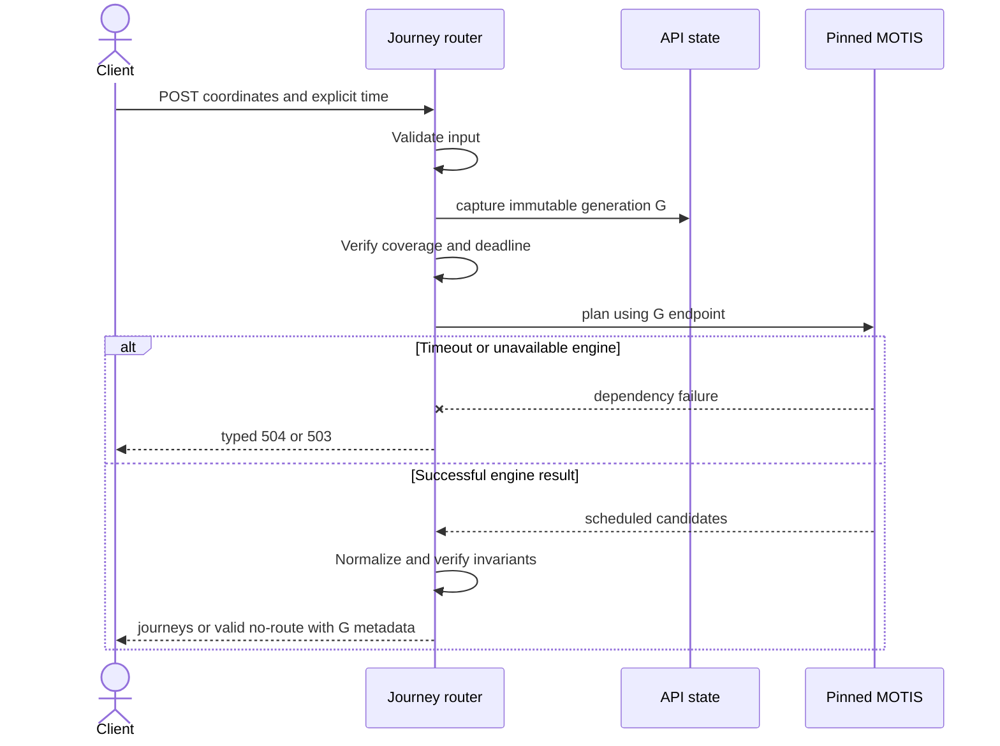
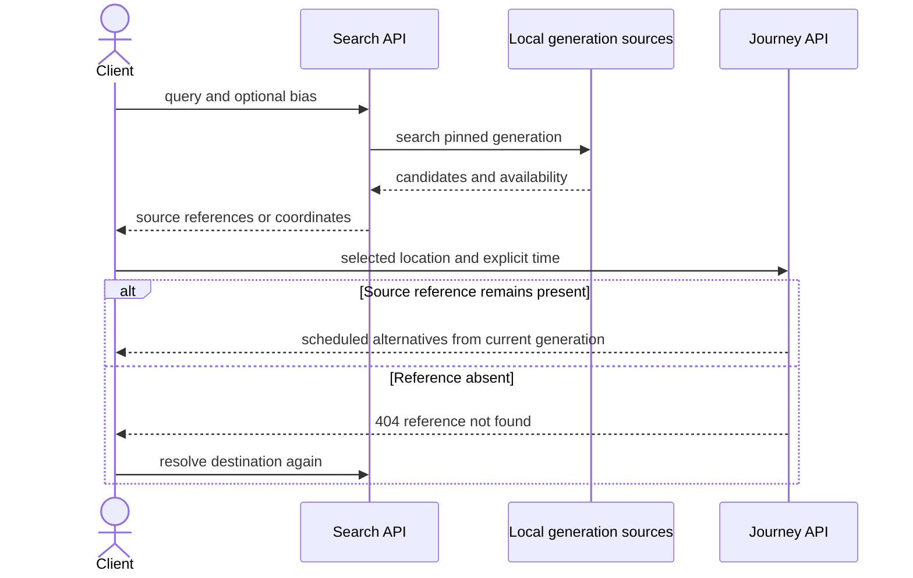
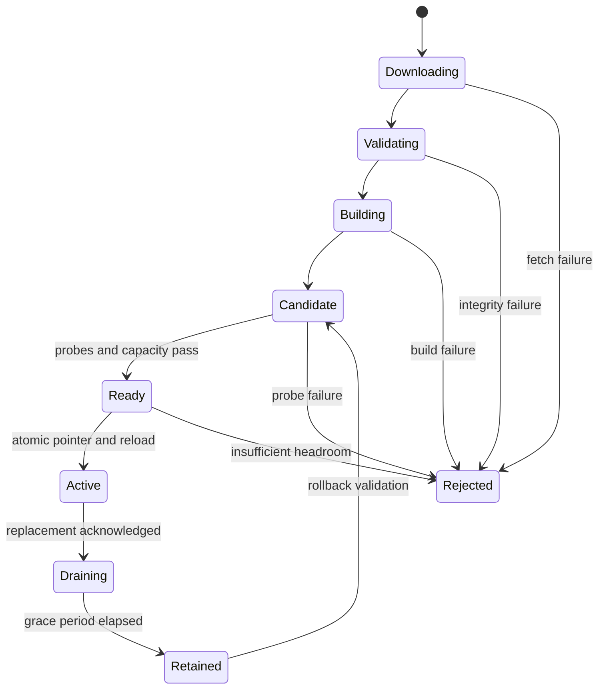
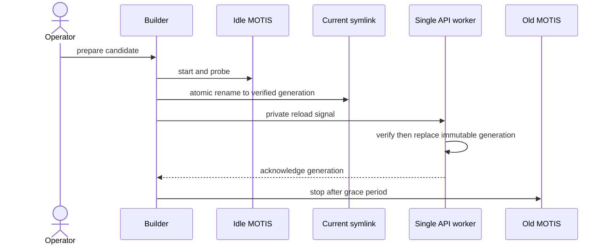
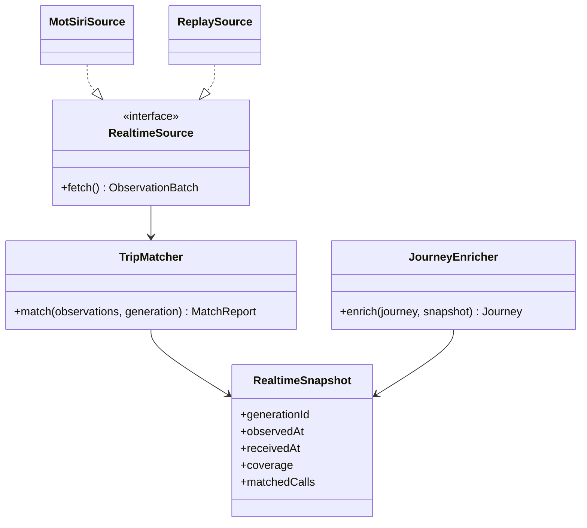

# OpenTransit API — System Design

**Version:** 1.2 · **Date:** 30 September 2026 · **Code status:** M1 implementation authorized; Fargate hosting selected, not deployed; later milestones remain planned.

Read the [API PRD](api-prd.md) first. This design implements schedule-first releases A–C and specifies extension points for D–F. [Architecture](architecture.md) is the short component map, [continuation plan](next-steps.md) maps work to milestones, and [dashboard](../PROJECT_STATUS.md) is the only maintained progress record.

This replaces the earlier realtime-first design and its unmeasured capacity/cost assertions. Accepted choices remain Python/FastAPI, MOTIS, the 60-day GTFS + TripIdToDate baseline, and existing PoC storage decisions. The user authorized applying R1–R5 and starting implementation on September 30; [ADR 0007](../poc/docs/adr/0007-schedule-api-design.md) records the accepted design. Its hosting amendment selects ECS Fargate with a prepared generation in a private ECR image and optional S3. Resource defaults remain starting values to verify; deployment needs a concrete cost/networking plan.

**Accepted priority correction:** first build one working local journey endpoint using the prepared MOTIS graph. The complete structure below is the target design, not M1 scaffolding. Minimal configuration, an adapter, input/output models and focused checks are sufficient initially. CI/contract automation follows in M7; contributor onboarding and repository polish move to Phase 5.

## 0. Review proposals — simplifications

**Accepted 30 September 2026.** The user authorized applying the suggested simplifications and starting implementation. The sections below now incorporate these choices. The [M1–M4 plan](next-steps.md#m1m4-delivery-plan) follows them. The product guarantees are unchanged: old-or-new generation consistency (N05), honest scheduled-only labels, no off-host calls on requests, and the 8 GiB serving cap.

| # | Superseded design | Concern | Accepted replacement | Updated sections |
| --- | --- | --- | --- | --- |
| R1 | Lease registry, Unix-socket activation control, fsync recovery journal | A large amount of custom concurrency and crash-recovery code for one API worker and one nightly refresh | **Local blue/green:** probe an idle MOTIS, atomically rename `current`, reload an immutable `Generation`, then stop the old engine after acknowledgement/grace. Each request captures one generation. **Fargate amendment:** each task pins a fixed generation from its image; replace complete tasks after readiness and drain old requests. No cross-task symlink or reload signal. | §2 deployment, §4 request reference, §8 local and Fargate activation |
| R2 | Generation-scoped opaque IDs; 410 after every activation; signed cursors | With nightly refresh, every stop or route ID a client saved would expire daily. Signing adds key management for cursors that grant no access. | Namespaced **source IDs** for stops/routes, if the M2 check shows GTFS IDs stable across feeds. Trip reference = source trip ID plus service date; 404 when absent. Cursors are unsigned encoded (generation, sort key, query digest), validated as untrusted input; a mismatch asks the client to restart the listing. `generationId` stays in `meta`. | §5 identity/lifetime, related 410 cases |
| R3 | domain/application/ports/adapters/runtime layers plus a separate ingestion package | Ports and use-case classes with one implementation each add indirection for a solo project | One package (`api/`, `core/`, `motis.py`, `reference.py`, `build/`) with one lock file and two entry points. Keep the rule that `core` does not import FastAPI. Add a protocol when a second implementation arrives (e.g. a realtime source). | §3 tree and dependency diagram, §4 port classes |
| R4 | Custom in-memory immutable indexes; PoC Postgres/PostGIS kept nearby | Custom structures need their own serialization and loading code; Postgres is not needed on the serving host | One read-only **SQLite** file per generation (standard library) for reference data and stop-name search (FTS5 to be measured in M4). Departures and trips come from MOTIS. No Postgres on the host; the PoC keeps its own. | §1 "do now", §3 `indexes.py`, §8 artifacts |
| R5 | Circuit breaker, hashed-key quotas, journey/search caches, `/metrics`, multi-worker activation | Useful at scale, but no traffic exists yet | M1–M4: timeouts, one concurrency semaphore, body limit. M7: a simple in-app per-IP limiter, plus `/metrics` only if something scrapes it. Add a breaker, caches or workers after a measurement shows the need. | §9 breaker, §10 quotas/caches, §11 metrics |

R1 moves basic local activation from M7 into M2, because a 60-day feed needs routine rebuilds anyway. Fargate task rollout is verified at H-1; M7 keeps concurrent-activation and fault-injection proof. Selected hosting and remaining implementation choices are in the [hosting plan](next-steps.md#hosting-plan).

## 1. Design drivers and choices

| Driver | Design response | Requirement |
| --- | --- | --- |
| Solo-maintained Python API | Modular application; one initial API worker | F07, N09 |
| Fast scheduled answers | Loaded immutable indexes and same-host MOTIS | F01–F04, N01/N02/N04 |
| Correct identities during refresh | Each request pins one complete generation and engine | F06, N05 |
| No realtime for v1 | Scheduled-only timing and disabled capabilities | F05 |
| Later live enrichment | Preserve service dates, full trip identity and nullable prediction fields | US13/US14 |
| Limited capacity evidence | Measure full stack and replacement under intended 8 GiB cap | N03 |
| No user accounts/history | Stateless passenger API; client-owned plans/favorites | N10 |

**Do now:** FastAPI, typed DTOs, asynchronous on-host MOTIS adapter, read-only per-generation SQLite reference data, a separate feed-builder process and disk-backed artifacts. Retain established PoC Postgres/PostGIS for staging/evidence where needed; it is never a passenger request dependency. ADR 0003 applies to POC-1 and is not revoked.

**Defer:** Redis, queues, microservices, cloud storage requirements, analytics databases, live pollers, accounts and frontend code. Select supported Python/FastAPI/Pydantic/Uvicorn/httpx versions and lock them in M1, along with the tested MOTIS image digest. The PoC's mutable `latest` image is not a production pin.

## 2. Context and deployment boundaries



Production runs API/MOTIS in separate containers within the same Fargate task, communicating over localhost. Local Compose uses container-local DNS. Only HTTPS API ingress is public; MOTIS is private. No off-task engine, S3 or source call occurs on a passenger request. Builder downloads and image pulls happen outside that path. Source URLs come from trusted configuration, never user parameters.

Initially one steady task is planned, not HA. Replacement restores one fixed generation from private ECR; S3 and a persistent server disk are optional. The included ephemeral filesystem must pass MOTIS startup/probe checks. Task size starts as a 0.5 vCPU / 2 GiB test candidate, not verified capacity. Old/new task overlap, ingress and serving telemetry count toward the aggregate 8 GiB ceiling; build memory and platform overhead are reported separately. If overlap cannot fit, keep the old generation and revisit topology before claiming uninterrupted refresh. Region, ingress and total cost remain H-0 choices.

## 3. Code organization and dependency direction

Proposed paths below are a design, not files created by this task:

```text
services/api/
  pyproject.toml                 one package and dependency set
  uv.lock                        reproducible resolved dependencies
  src/opentransit/
    config.py                    validated environment settings
    api/                         HTTP schemas, routing and safe errors
    core/                        generation, time and identity rules
    motis.py                     engine client and normalization
    reference.py                 read-only SQLite (M2)
    build/                       separate feed CLI process
  tests/                         focused behavior and integration checks
docs/api/openapi.yaml            compatibility snapshot (M7 onward)
```

Create modules when behavior arrives. M1 needs configuration, HTTP schemas, one MOTIS adapter and a fixed verified generation; it does not create M2's reference store or activation runtime. Reviewed PoC logic may be extracted with regression checks; scripts with side effects are not imported.



`core` does not import FastAPI. Do not add ports or use-case classes with only one implementation; add a protocol when a second implementation requires it. One package exposes an API process and a separate feed CLI. Use FastAPI [lifespan](https://fastapi.tiangolo.com/advanced/events/) for the shared asynchronous HTTP client; builders never run on passenger requests.

## 4. UML class design

### Request generation and engine client



A request captures one immutable generation object before any await. The engine client uses that object's endpoint throughout. Local reload constructs and verifies a new object, then replaces the process reference; M1 has no reload behavior and M2 adds it locally. In Fargate the reference is fixed for the task lifetime: API, SQLite and localhost MOTIS all use the image's generation. ECS replaces complete tasks. No lease registry or explicit release protocol is required for one worker and deadline-bounded requests.

### Domain and identity



Pattern identity includes ordered stops and pickup/drop-off semantics, not just route/direction. Repeated stops are distinct calls. A journey ID identifies an alternative in one response, not a durable server lookup token.

## 5. Data contract and time model

| Type | Required semantics |
| --- | --- |
| Location | Discriminated coordinate, stop reference or selected place reference; no raw text |
| GenerationId | Content identity of feed/mapping/OSM/config/schema/engine inputs; hash excludes its own ID and nondeterministic timestamps |
| Stop/Route IDs | Namespaced full source IDs if M2 proves stability across daily feeds; no daily expiry; 404 when absent |
| Pattern IDs | Content identity of ordered calls and restrictions; remains generation-attributed |
| TripRef | Full source trip ID + service date; retain engine occurrence identity and frequency start time when present; generation remains metadata |
| CallKey | Trip occurrence + sequence; stop ID alone cannot identify loop calls |
| PlaceCandidate | Kind, label/language, locality, precision, coordinates, reference and attribution |
| JourneyQuery | Two locations, exactly one time mode, modes, per-leg walk bound, result count |
| TransitLeg | Scheduled instants, operator/route/headsign, board/alight calls, trip reference, nullable predictions/delay, geometry state |
| WalkLeg | Duration/distance, endpoints and geometry; no live claim |
| Metadata | Request ID, generatedAt, mode, generation, coverage, freshness, capabilities, attribution, ranking policy where relevant |
| Page | Limit and unsigned encoded nextCursor with generation, query digest and exact sort key; null when exhausted |

Keep raw GTFS times and service dates. Conversion must follow [GTFS time semantics](https://gtfs.org/documentation/schedule/reference/#field-types), including the service-day origin and daylight-saving transitions; do not simply attach a timezone to a naive clock. Cross-check engine timestamps with fixtures for >24-hour calls, spring gaps and autumn overlaps. Departures inspect all intersecting service dates, including the preceding date. TripIdToDate remains paired with the feed; normalized key overlap is not dated-trip proof.

If frequency-based services occur, distinguish exact generated departures from frequency estimates. Unsupported feed constructs require candidate rejection or an explicit reviewed coverage limitation, never invented exact times. Transit call nulls stay explicit unless an engine estimate is documented and labelled.

Public references retain complete source keys and are bounded typed inputs. The M2 stability check decides whether namespaced stop/route source IDs are safe; if it fails, record a revised scheme before exposing reference endpoints. Trip references preserve the full source trip ID and service date; never infer the service date from boarding time alone.

Cursors are unsigned encoded (generation, query digest, stable sort key), validated as untrusted input. A generation/query mismatch returns `422 INVALID_CURSOR` and asks the client to restart the listing. IDs grant no authorization and need no signing keys. A source ID absent from the active feed returns 404; do not silently redirect a missing dated trip to a similar trip. Generation attribution stays in metadata.

## 6. HTTP contract and examples

See the [complete endpoint inventory](api-prd.md#5-proposed-http-surface). Examples are synthetic illustrations, not verified transit observations. D3 POST planning is accepted; M1 exposes only coordinate/depart-at inputs.

```json
{
  "from": {"kind": "coordinate", "latitude": 32.0757, "longitude": 34.7748},
  "to": {"kind": "coordinate", "latitude": 32.7775, "longitude": 35.0219},
  "departAt": "2026-09-24T08:00:00+03:00",
  "modes": ["bus", "rail", "light_rail"],
  "maxWalkMinutesPerLeg": 15,
  "results": 3,
  "lang": "he"
}
```

`arriveBy` replaces `departAt`; neither is silently filled. Reject incompatible location fields, invalid/nonfinite coordinates, unsupported constraints and dates outside coverage before planning. Coverage is the actual graph/timetable intersection, not the nominal “60-day” filename.

Success is `data: {outcome: routes_found, journeys: [...]}` or `data: {outcome: no_route, journeys: []}`. Each alternative has ordered legs, geometry state, totals and applied constraints. Reject malformed engine alternatives; if none can be trusted, return a dependency/data error. Only a successfully executed empty search becomes no-route.

Shared metadata/timing fragment (not a complete response schema):

```json
{
  "timing": {
    "scheduledDeparture": "2026-09-24T08:12:00+03:00",
    "scheduledArrival": "2026-09-24T08:32:00+03:00",
    "expectedDeparture": null,
    "expectedArrival": null,
    "delaySeconds": null,
    "timingState": "scheduled",
    "observedAt": null
  },
  "alerts": null,
  "meta": {
    "requestId": "example-request",
    "generationId": "example-generation",
    "generatedAt": "2026-09-24T05:00:00Z",
    "mode": "fixture",
    "coverage": {"from": "2026-09-24T00:00:00+03:00", "until": "2026-09-26T00:00:00+03:00"},
    "freshness": "current",
    "capabilities": {"realtime": "not_enabled", "alerts": "not_enabled"},
    "attribution": ["synthetic-fixture"]
  }
}
```

Coverage and departure windows are half-open `[from, until)`; every required leg must be covered. Trip calls expose serviceDate separately from calendar date. Response timestamps have explicit offsets. GeoJSON uses longitude/latitude order; query coordinates have named fields.

Search returns `matchedTypes`, `unavailableTypes` and `partial` when only some categories work. If all requested categories are down, return 503; valid zero matches return 200. Default language is Hebrew, English supported; expose actual label language and original name when translation is absent.

Pages sort by relevance/distance then ID; departures sort by instant, occurrence and sequence. Cursors bind generation and the full query. Route detail has a bounded summary; pattern pages return complete ordered patterns. Candidate validation checks excessive call counts/payload size rather than letting malformed trips create unbounded responses.

Status serves cached in-process health and can return 200 while reporting routing unavailable. `/readyz` returns 503 in that condition. Use RFC 9457 problems with stable `urn:opentransit:problem:*` types:

```json
{
  "type": "urn:opentransit:problem:invalid-cursor",
  "title": "Listing cursor changed",
  "status": 422,
  "code": "INVALID_CURSOR",
  "detail": "Restart the listing using the active generation.",
  "requestId": "example-request",
  "activeGenerationId": "example-new-generation"
}
```

Map framework validation errors to safe field paths/reasons, removing rejected inputs. Stable codes distinguish outside service window/area, unsupported constraints, expired feed, unavailable/timed-out engine, invalid cursor and overload. Follow the PRD status table; failures never become empty business results.

## 7. UML request sequences

### Journey planning — US01/US05



One request uses one generation throughout awaits. Disconnect cancels downstream work where supported. Reference resolution (M2/M3) uses the captured reference store and never performs off-host geocoding.

### Search → plan — US02/US01



## 8. Feed builder and atomic activation

Each immutable manifest records normalized reference/index artifacts, engine graph, source hashes/acquisition times, normalization/schema versions, engine digest, configuration digest, measured coverage, attribution and validation report references. Identity depends on all interpretation-affecting inputs. Stage into a new directory, verify hashes and sizes, then mark ready.

### Production: Fargate task replacement

Build/validate outside serving, then package a complete generation into a private ECR image. The task definition pins runtime and generation image digests. Start API and MOTIS only after generation files are available on local task storage; require hashes, coverage, reference/graph agreement and routing probes before readiness. Use an image containing the MOTIS runtime and artifacts or a data-initialization container with completion dependencies and a shared task-local volume; verify the chosen layout in H-0. S3 is not required. Never rely on task disk to retain source evidence.

Publish each refreshed generation as a new image and ECS revision. Overlap healthy old/new tasks, send traffic only to ready targets, and drain old requests before stopping old tasks. Configure/test failed-deployment rollback; a bad candidate must not remove the valid old revision. During rollout requests may receive either generation, but every response uses one complete generation. No cross-task `current` symlink or reload signal is used. Keep previous/evidence-pinned images; coverage/freshness checks still precede rollback. Count complete old/new serving tasks and edge components under the 8 GiB ceiling. H-1/M7 validate this behavior; the [hosting plan](next-steps.md#hosting-plan) defines acceptance.

### Local Compose: pointer and reload

The following protocol and diagrams are the local M2 workflow, not production ECS control:

1. Download GTFS/mapping into staging and validate archives. Keep source timestamps separate from acquisition. Upstream files may change independently: verify pairing/service-date coherence and retry or reject incoherent pairs.
2. Parse required GTFS groups plus mapping/translations. Check references, ranges, ambiguous stop codes, sequences and date-aware pairing. Quarantine only under documented rules; never silently remove an operator.
3. Build indexes and MOTIS artifacts from pinned config/OSM. Record normalization without changing raw inputs.
4. Probe routing, departures, coverage and search against the candidate. Require reviewed semantic results, not merely HTTP 200.
5. Start the idle blue/green MOTIS at a private endpoint. Load its SQLite and manifest into a new immutable generation object; reject inconsistent artifacts or inadequate serving headroom.
6. Serialize operator activation, atomically rename the `current` symlink to the verified generation, then signal the single API worker to reload. Reload verifies and replaces the complete generation object; existing requests keep their old object.
7. Stop the old engine only after the API acknowledges reload and a grace period of at least ten request deadlines. Retain previous/evidence-pinned artifacts; pruning is a separate manual operation.





No custom recovery journal, Unix activation socket or lease registry. Operator access is through host permissions. Restart reads the atomic pointer and verifies that generation; a crash between rename and signal may leave the live process on the old complete generation until restart/reload. Keep both engines running until acknowledgement; failed reload keeps the old object and restores the pointer before reporting failure. M7 tests these failures under traffic. Fsync durability and signal mechanics must use the deployment filesystem's supported primitives; do not claim crash proof from the diagram.

One worker is required for this design. Multiple workers need an explicit acknowledgement protocol and separate tests before adoption. Failed rollback leaves readiness false if neither generation is valid. Background probes carry generation IDs so late old-engine results cannot change new-generation health.

## 9. Freshness, readiness and degradation

Freshness uses **last successful upstream validation**, not merely age of unchanged bytes. Identical downloaded content can renew source validation without rebuilding. Coverage and freshness are separate. Source modification time is provenance, not proof of refresh success.

Proposed policy: warn after 30 hours without successful source validation; stale after 48 hours; serve still-covered schedules with warnings for at most seven days since validation. At seven days or outside coverage, reject schedule-dependent requests. These defaults need review; no silent production override.

| Condition | Readiness / behavior | Recovery |
| --- | --- | --- |
| No valid generation | Readiness 503; status works; schedule endpoints 503 | Validate/load a complete generation |
| Fixture mode when introduced | Readiness 200 with fixture mode, no production claim | Explicit production configuration |
| MOTIS unavailable | Core readiness 503; planning/departures/trips fail; local references may still work | Bounded background probes/restart |
| Address dependency down | Core readiness can be 200; partial search or 503 for address-only request | Repair source; v1 release criteria still unmet |
| Failed refresh, active data valid | Keep ready with age/stale warnings as applicable | Backoff/retry; preserve active data |
| Coverage expired or hard freshness limit reached | Core readiness 503; typed schedule errors | Activate valid generation |
| Live capabilities disabled | No v1 readiness failure; predictions/alerts null | Deferred feature work |
| Candidate exceeds capacity | Reject activation; old generation unchanged | Revisit artifact/deployment strategy |

Background tasks probe local dependencies with deadlines and maintain an in-process health snapshot. Readiness/status never download data. Liveness checks the process, not timetable usability. Use bounded timeouts initially; add a circuit breaker only after measurements justify it (R5). Status 200 describes health and must not be used as a readiness probe.

## 10. Performance, concurrency and caching

Initial proposal: one Uvicorn worker, asynchronous keepalive HTTP to MOTIS, bounded admission, immutable indexes. CPU-heavy parsing/building stays outside the API. Never block async handlers with synchronous network clients. Measure before claiming Python or worker counts meet budgets.

| Control | Proposed starting point | Purpose |
| --- | --- | --- |
| Journey deadline | 1.5 seconds end-to-end at server | Bound tails, separate from p95 target |
| MOTIS planning timeout | <=1.2 seconds and remaining deadline | Reserve normalization/response budget |
| Search/departure deadlines | 300 ms dependency; 500 ms endpoint | Bounded failure; p95 target stays 40 ms |
| Concurrent journeys | 16, no unbounded queue | Protect engine; overload returns 503 |
| Request body | 16 KiB maximum | Small typed query, no uploads |
| Client rate quota (M7) | Simple in-app per-IP limiter; starting 60/minute, burst 20 | Tune from evidence including carrier NAT |
| Journey subquota | Deferred until traffic measurements justify it | Avoid premature policy machinery |
| Metrics labels | Route template, bounded code/mode | Avoid sensitive/high-cardinality labels |

M7 quotas return 429 + Retry-After; capacity saturation returns 503. A shared bounded engine-client pool also limits combined search/departure load. Pool sizes are measured in M7. No automatic expensive retries near deadline. Operator load probes have a private explicit policy so quotas do not falsify capacity measurements; separately test the public quota path.

Start without a journey cache. Rounding departure time can change reachability. If profiling justifies one, key by exact normalized query, generation, ranking and language, with byte/time bounds. Never reuse another generation's answer. Search caching is also deferred until profiling shows a need.

Edge policy: no-store for journeys, search, nearby queries and departures. Reference resources without passenger input may later use generation-scoped ETags. Status is no-store or very short-lived with explicit age. Never persist raw query-derived cache keys in logs.

### Full-stack load protocol

Proposed M7 benchmark: 50 requests/second for 15 minutes, 30% journeys / 30% search / 25% departures / 15% references/status; additionally a 30-minute soak and activation under load. Record offered/achieved throughput, concurrency, rejections, errors, latency distributions, input/corpus hashes, CPU and peak memory. Report each endpoint separately, cold/warm behavior, and disable caches for the primary routing baseline.

Include long routes, ambiguous queries and no-route cases. Proposed unexpected 5xx rate <0.5% at target load; show overload/timeouts separately and include them in total failure counts. An external regional probe measures <400 ms deployed p95 separately from <350 ms API duration; record network/TLS boundaries and repeat weekday evenings. No daily-user capacity estimate follows from an engine benchmark.

Historical MOTIS p95 162.9 ms and roughly 941 MB load peak are engine-only evidence. Graph replacement must fit the aggregate serving cap with all components; off-host building alone does not solve serving overlap. No current cloud price or hosting purchase is assumed.

## 11. Security, privacy and operations

- HTTPS at ingress; private MOTIS, artifacts and activation control; expose private metrics only if a collector needs them. Production operator actions use least-privilege AWS IAM; local reload uses host authorization, not passenger credentials.
- No user-supplied source URL/path/engine endpoint. Validate source references and bounds; use structured HTTP query encoding.
- Remove query strings, bodies, raw path references and rejected inputs from proxy/app logs and traces. Log route template, generated request ID, safe code, generation and duration. Validate/replace supplied request IDs.
- No accounts, durable location history or behavioral analytics. M7 rate-limit counters are ephemeral, bounded and expire; routine logs retain seven days. Review any proxy/host raw-IP logging separately; do not claim anonymity while retaining it.
- Anonymous quotas are coarse abuse controls; shared carrier NAT may affect many users. Tune from aggregate evidence; introduce API keys only if a later distribution policy requires them.
- Explicit CORS origins and trusted proxies; CORS does not authenticate callers. Validate configuration at startup. Secrets remain outside Git; static v1 needs no live MOT key.
- API/engine mount artifacts read-only, run non-root where supported. Builder has separate write access and enforces archive traversal, expansion and file-count limits.
- Safe logs initially cover failures and durations; add `/metrics` in M7 only when a collector needs it, with bounded labels. Alert on expiry, repeated refresh failures and unexpected memory growth.
- Cleanup protects active, draining, rollback and evidence-pinned generations. Require explicit dry-run selection before deletion. Existing ignored PoC feeds/artifacts are never deleted as incidental setup.

### Deployment, backup and recovery

Selected Fargate/ECR hosting, optional S3, deferred static SIRI egress and deployment checks: [hosting plan](next-steps.md#hosting-plan). Region, ingress and monthly cost are not yet verified.

M8 packages the API and pinned engine as versioned containers, with a separate builder profile. Promote the same tested artifacts into deployment; startup verifies schema/image compatibility before readiness. API-code rollback and data-generation rollback are separate operations: select a compatible application image and manifest together. Stop accepting new traffic, drain within the configured request deadline, then terminate; abrupt shutdown must not corrupt immutable artifacts.

Back up the committed manifest, provenance, configuration templates and reproducible artifact inputs outside the serving disk using a cold-path mechanism. Keep private credentials in a separate protected store. Proposed recovery objectives for review: restore service within one hour after a recoverable host/disk failure, and lose no committed generation manifest (copy it on activation); large rebuildable artifacts may use a daily backup cadence. Run a restore drill before release and report actual recovery time. If the target cannot be met, revise topology or the target explicitly; a single host still cannot promise uninterrupted operation.

Operator runbooks must cover expired feed, failed build, disk pressure, activation failure, engine outage, application rollback and lost host. No destructive cleanup command is part of this design deliverable.

## 12. OpenAPI and compatibility workflow

M1 uses FastAPI-generated docs/schema for its actual working endpoints. Mark the local preview contract provisional. M7 introduces the checked-in compatibility snapshot and CI comparison against the exported schema before v1 publication. Update both in one contract change. This is a generated-and-reviewed contract, not two independently maintained sources or a circular handler generator.

Planning examples are not production OpenAPI. Add domain schemas before their milestone handlers are released; include success, empty, fixture, scheduled, stale, no-route and problem examples. Contract tests validate real responses and flag incompatible type/required-field/status changes.

Reserve timing states at initial publication: scheduled, predicted, stale, cancelled, unknown. V1 valid timetable calls emit scheduled. Capability states: not_enabled, available, degraded, unavailable. Disabled is intentional absence; unavailable is failure of an enabled feature. Optional additive fields can remain in v1; changes in enum meaning, default ranking, identity lifetime or required fields need explicit compatibility/version review.

## 13. Future live integration

Later introduce a separate single-owner ingester with source adapters, date-aware reconciliation and immutable snapshots. Only it holds MOT credentials. Poll rates follow verified source terms, not assumptions in earlier proposals.



Future requests pin a compatible static-generation/realtime/alerts tuple. Never join a mismatched generation by stripped IDs. If no matched snapshot exists after feed activation, serve schedules until a compatible one arrives. Recheck freshness at read time: a stopped ingester must not leave a permanent live claim.

Keep source observedAt, receivedAt and publishedAt distinct. Record unmatched, ambiguous, stale and rejected observations with explicit denominators by operator/mode. Match generation, service date, trip identity and call sequence; line/stop similarity through midnight is insufficient.

Alerts have independent freshness and entity/time resolution. Null means unavailable; [] means a successfully fetched source with no applicable messages. Cancellation needs positive evidence. Redis/fan-out is optional when multiple processes actually need it; passenger state remains local.

Realtime-aware routing is more than annotating schedule routes: version the ranking policy and evaluate transfer outcomes before changing defaults. Historical analytics are cold-path work over permitted archived observations; show sample sizes and uncertainty in future confidence outputs.

## 14. Verification and traceability

These checks are planned, not executed by writing this document. H3/H4 still need recorded human approval.

| Scenario | Requirement/story | Milestone/evidence |
| --- | --- | --- |
| Minimal startup, prepared graph and engine unavailable | F07, US09/10 | M1 local journey smoke/failure checks; full readiness in M7 |
| Bounds, conflicting times, safe problems, schema compatibility | F03/F07, US01/05/09, N07/N10 | Input/error checks M1–M4; schema automation M7 |
| Service dates, >24h, DST, loop calls, boarding restrictions, full IDs | F02–F04, US04/06/07 | M2/M3 deterministic fixtures |
| Pinned engine planning/arrive-by/constraints, no-route vs timeout | F03, US01/05, N04 | M3 adapter conformance and H3 |
| Category/language search, duplicates, bias and unknown precision | F01, US02 | M4 accepted-feed corpus and H4 |
| Old reference/cursor across activation under traffic | F06, US06/11, N05 | M7 concurrent integration test |
| Kill builder, incoherent pair, activation crash, restart/rollback | F06, US10/11 | M2 validation; M7 fault injection |
| Expired coverage, freshness limit, disabled alerts, missing geometry | F05, US08 | M3/M7 pinned-clock degradation |
| Sentinel coordinates/query/secret absent from proxy/app logs | N10, US12 | M1 policy; M7 full-stack inspection |
| Traffic mix/soak, replacement memory, external probe | N01–N03/N06/N07 | M7/M8 versioned results |
| Thousands of dated observations and real alerts feed | US13/14 | Deferred M5/M6; replay labelled separately |

Focused local checks accompany the first journey endpoint. CI is added in M7 and uses synthetic/licensed small fixtures, not nationwide downloads or live credentials. Portable contributor fixture packaging remains Phase 5. Opt-in real-data runs pin provenance and preserve previous outputs. Documentation-only changes do not require expensive experiment reruns.

## 15. Build sequence after planning review

Step-level M1–M4 work, hosting services and non-code tasks: [delivery plan](next-steps.md#m1m4-delivery-plan).

| Milestone | Implementation | Completion/dependency |
| --- | --- | --- |
| M1 | Minimal FastAPI plus prepared MOTIS graph: coordinate/depart-at request, one normalized scheduled journey, safe errors, generated docs and focused checks | Review plan first; demonstrate a real local HTTP journey; no contributor/CI prerequisite |
| M2 | Artifact generation/validation, indexes, stops/routes/pattern APIs | Accepted feed; historical PoC preserved |
| M3 | MOTIS adapter, dated trips, departures and planning | Verify time/constraints; H3 before release |
| M4 | Local search merging and evidence-backed addresses | Category/language/latency evidence; H4 before release |
| M7 | Activation/recovery, freshness, privacy/quotas, CI/schema automation and load | Static release/terms requirements complete |
| M8 | Deployment, docs/status, monitoring/runbook | Scheduled real-data probe; then client |
| M5/M6 later | Live adapters/matching/snapshots and alerts | Access/terms and real-source evidence |
| Phase 5 | Contributor onboarding, portable demos, contribution templates and repository/community polish | Useful product already working; not a gate for M1 or v1 |

## 16. Risks and unresolved choices

| Risk/choice | Consequence | Resolution |
| --- | --- | --- |
| Pinned MOTIS differs from upstream docs | Unsupported or misinterpreted API behavior | Inspect pinned schema and conformance-test adapter |
| Weak address search | Destination input unusable | Evaluate normalization/local alternative; explicit scope review if unresolved |
| Overlap exceeds 8 GiB | Seamless activation not proven | Measure early; revise architecture, not cap just to pass |
| One API worker misses target | Latency/queue pressure | Profile first; multi-worker generation coordination needs tests |
| Immediate reference expiry | Saved IDs need re-resolution | Publish lifecycle and coordinates; stable aliases only with evidence |
| Static usage terms unresolved | Release cannot be accepted | Record authoritative terms/reviewer decision |
| Proposed quota/freshness/quality defaults | May harm usability or hide weak quality | Review PRD decisions before contract publication |
| Single host failure | Outage | Document recovery; redundancy follows measured need/budget |

## 17. Technical sources and provenance

- [FastAPI lifespan](https://fastapi.tiangolo.com/advanced/events/) and [dependencies](https://fastapi.tiangolo.com/tutorial/dependencies/) support the composition approach; pin exact versions in M1.
- [RFC 9457](https://www.rfc-editor.org/rfc/rfc9457.html) defines the problem-details format used here.
- [MOTIS upstream OpenAPI](https://github.com/motis-project/motis/blob/master/openapi.yaml) is a reference, not proof about the tested image. PoC Compose probes `/api/v6/plan`; use the pinned image's matching schema rather than copying upstream main paths.
- [ADRs](../poc/docs/adr/), [accepted-feed evidence](../poc/docs/primary-feed-rerun.md) and [access record](data-usage-and-access.md) establish decisions/evidence. No new performance or external-access experiment was run for this design.
